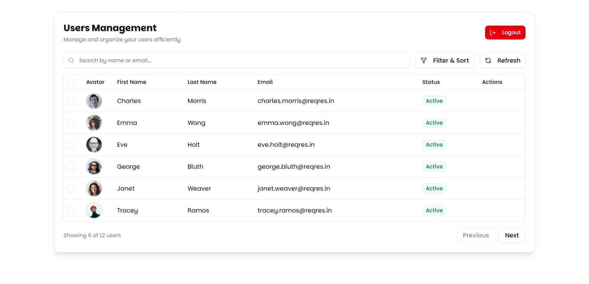

# User Management Application

A simple React application for user management with authentication. Built using modern web technologies and a clean user interface.





## Features

- User authentication (login)
- View list of users
- Sort and filter users
- Edit user details
- Delete users (single or bulk)
- Responsive design for mobile and desktop

## Tech Stack

- React with TypeScript
- Vite for build tooling
- TanStack Query for data fetching
- React Router for navigation
- Axios for API calls
- Tailwind CSS for styling
- Shadcn UI components
- Sonner for toast notifications

## Getting Started

1. Clone the repository
2. Install dependencies:
```bash
npm install
```
3. Start the development server:
```bash
npm run dev
```
4. Open http://localhost:5173 in your browser
### Login Credentials
#### Use these credentials to test the application:
- Email: eve.holt@reqres.in
- Password: cityslicka

## API
#### This project uses the ReqRes API for demonstration purposes.